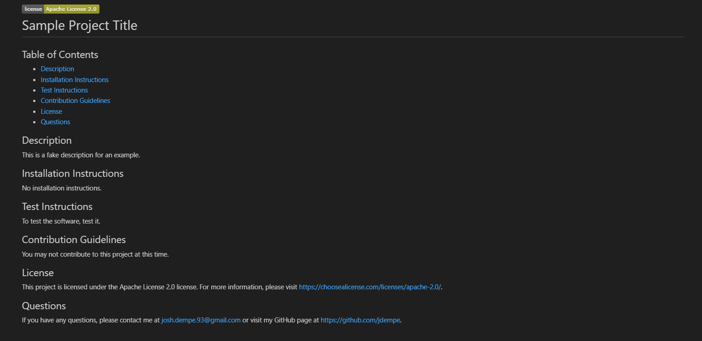

# CBC Week 09 Challenge: README Generator
## Description

This project is the seventh from the UC Berkeley Coding Boot Camp.  The goal is to create a command-line application that dynamically generates a professional README.md file from a user's input.  The application uses the inquirer package to accomplish this, as it provides pre-made solutions to many different kinds of text prompts.  The user will be prompted for their GitHub username and other information pertaining to the project the README is for.  The application will then generate a README.md file based on the user's input.  The README will include the following sections:

- Title
- Table of Contents
- Description
- Installation Instructions
- Usage Information
- Test Instructions
- Contribution Guidelines
- License
- Questions

There will also be a badge for the license that is chosen and a link to the license.  The Table of Contents will be dynamically generated based on the user's input.  If the user does not provide certain information, the section will not be included in the README.

The major challenge of this project was to dynamically generate the Table of Contents.  It was important that the user could opt to skip writing the section while still generating it, so a default message was created for every section to ensure the section would be generated unless the user specifically deleted the default message.

## Final Product

The final product can be downloaded at https://github.com/JDempe/bootcamp-09-readme-generator.

### Prerequisites

To run the application, you will need to have the following installed on your machine:
1. [Node.js](https://nodejs.org/en/)

### User Interface

The application uses the command line interface (CLI) to prompt the user for information.  The user will be prompted for their GitHub username and other information pertaining to the project the README is for.  The user simply answers the questions.

### Usage Instructions

To use the application, follow these steps:

1. Clone the repository to your local machine.
2. Open the repository in your preferred code editor.
3. From the root folder, run the command 'npm install' in your terminal to install dependencies.
4. From the root folder, run the command 'node index.js' in your terminal to start the application.
5. Answer the questions as prompted.  To remove a section from the README, delete all contents from the text field.  Otherwise, it will create the section in the README with the default message of No information provided.

Below is a video of the application being used.

<video src="https://user-images.githubusercontent.com/123279032/231547866-47bc9d34-5746-484e-a928-8914c48ad757.mp4" controls="controls" style="max-width: 730px;"></video>

And this is the output from the above video.  Notice that because no text was provided in the usage instructions, it excludes both the Usage Instruction Section as well as the Table of Contents link.  

<kbd> </kbd>

## Credits

### Resources

The below resources contributed to the project.

- [jQuery](https://jquery.com/) is a fast, small, and feature-rich JavaScript library.

- [Node.js](https://nodejs.org/en/) is a JavaScript runtime built on Chrome's V8 JavaScript engine.  The file system module is used to read and write files.

- [Inquirer](https://www.npmjs.com/package/inquirer) is a collection of common interactive command line user interfaces.

- [Shield.io](https://shields.io/category/license) is a service to create badges for GitHub repositories.
  
- [StackOverflow](https://stackoverflow.com/) provided many answers to my questions.
  - [Creating a Table of Contents in Markdown](https://stackoverflow.com/questions/11948245/markdown-to-create-pages-and-table-of-contents)
  - [Providing a background for images in Markdown](https://stackoverflow.com/questions/37349314/is-it-possible-to-add-border-to-image-in-github-markdown)
  
### Collaborators

On this project, there was no peer review or collaboration.

## License

Refer to the LICENSE in the repository.

## How to Contribute

Contribute at https://github.com/JDempe/bootcamp-09-readme-generator.
